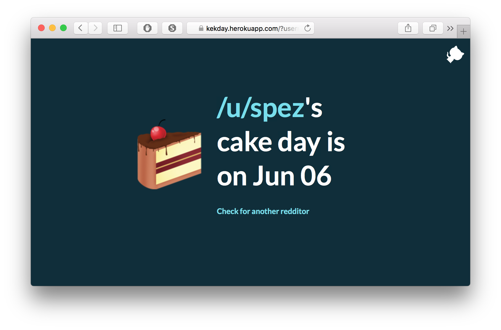

# kekday

This is a Flask web app to find cake day of any Redditor. For more details check [this](http://avi.im/blag/2015/kekday/) blog post.

## License

The mighty MIT License. Check `LICENSE` for more details.